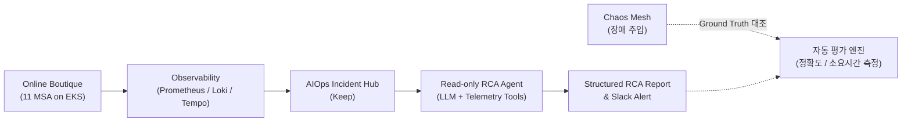

# Kubernetes AIOps RCA & Chaos Evaluation Platform

> **Note:** 본 프로젝트는 현재 개발 및 구축 진행 중(WIP)인 저장소입니다. 세부 구조와 구현 내용은 진행 상황에 따라 변경될 수 있습니다.

> [!NOTE]
> **Workload Attribution:**  
> This project uses Google Cloud's [Online Boutique (microservices-demo)](https://github.com/GoogleCloudPlatform/microservices-demo) as the target microservice workload.  
> The infrastructure, observability stack, chaos experiments, AIOps/RCA pipeline, and evaluation framework are independently designed and implemented as part of this project.

Kubernetes 마이크로서비스 환경에서 발생하는 다수의 Alert를 인시던트(Incident) 단위로 그룹화하고, **Read-only LLM Agent가 다차원 텔레메트리(Metrics, Logs, Traces)를 자율 조사하여 1차 근본 원인 분석(RCA)을 수행하는 시스템**입니다.

Chaos Engineering을 통해 재현 가능한 장애(Ground Truth)를 주입하고, Agent의 진단 정확도와 시간을 정량적으로 반복 평가하는 파이프라인 구축을 목표로 합니다.

---

## 🏗️ 전체 아키텍처 개요



---

## 🛠️ 주요 기술 스택

| 영역 | 구성 요소 | 비고 |
| :--- | :--- | :--- |
| **Cloud & Infra** | AWS EKS (`v1.37`), Terraform, `fck-nat` | x86_64 (`t3.large`) 노드 그룹, FinOps 최적화 |
| **Target App** | Google Cloud Online Boutique (11 Services) | 마이크로서비스 및 In-Cluster Redis 캐시 |
| **Observability** | Prometheus, Grafana Loki, Tempo, Grafana | Metrics, Logs, Distributed Traces 수집 |
| **AIOps & Incident** | Keep, Claude / OpenAI LLM API | Alert Deduplication, Incident 그룹화, RCA 파이프라인 |
| **Chaos & Eval** | Chaos Mesh, Python Evaluation Harness | 재현 가능한 장애 주입 및 RCA 정확도 정량 평가 |

---

## 📁 주요 디렉토리 구조

```text
├── terraform/               # AWS VPC, fck-nat, EKS v1.37 프로비저닝 (IaC)
├── helm-chart/              # Online Boutique 애플리케이션 Helm 차트
├── docs/
│   ├── infra-project/       # 시스템 아키텍처, ADR-001(x86_64 채택 근거), 실험 계획
│   └── msa/                 # 기존 Online Boutique 세부 개발 가이드
├── project.md               # 프로젝트 상세 기획 및 실험/평가 지표 정의서
└── msa_README.md            # Online Boutique 원본 README
```

---

## 🚀 빠른 시작 (Quick Start)

### 1. 인프라 배포 (Terraform)
```bash
cd terraform/envs/dev
terraform init
terraform plan
terraform apply
```

### 2. EKS 클러스터 접속 설정
```bash
aws eks update-kubeconfig --region ap-northeast-2 --name msa-demo-dev-eks
kubectl get nodes -o wide
```

### 3. 애플리케이션 배포 (Online Boutique)
```bash
helm upgrade --install onlineboutique ./helm-chart \
  --namespace onlineboutique \
  --create-namespace
```

---

## 📑 관련 문서 링크

* [시스템 아키텍처 정의서 (Architecture)](docs/infra-project/architecture.md)
* [아키텍처 결정 기록서 (ADR-001: x86_64 선정 배경)](docs/infra-project/decisions.md)
* [프로젝트 종합 기획서 (Project Overview)](project.md)
* [Online Boutique 원본 안내 (msa_README.md)](msa_README.md)
