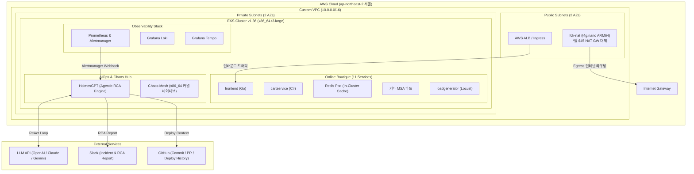

# 시스템 아키텍처 정의서 (System Architecture)

본 문서는 **지능형 AIOps 및 자가 치유(Self-Healing) 인시던트 파이프라인**을 위한 AWS 인프라, 쿠버네티스 클러스터 및 관측/장애 주입 스택의 아키텍처를 정의합니다.

---

## 1. 인프라 계층 (AWS Cloud)

### 주요 인프라 사양
* **리전:** AWS 서울 리전 (`ap-northeast-2`)
* **네트워크 (VPC):** 
  - CIDR: `10.0.0.0/16` (2 AZs: 2a, 2c)
  - Public Subnet 2개, Private Subnet 2개
  - **NAT 솔루션:** `fck-nat` (`t4g.nano` ARM64, 월 \$3.5 수준 초경량 NAT 인스턴스)
* **컨테이너 오케스트레이션 (EKS):**
  - **EKS 버전:** `v1.36` (최신 안정 버전)
  - **워커 노드 아키텍처:** **x86_64 (`t3.large`, AL2023_x86_64_STANDARD)**
  - *아키텍처 결정 근거:* [ADR-001 (x86_64 채택 근거)](decisions.md#adr-001-eks-워커-노드-아키텍처-선정-arm64-대신-x86_64-t3large-채택) 참조.

---

## 2. 계층별 구성 요소

| 계층 | 기술 스택 | 설명 |
| :--- | :--- | :--- |
| **인프라 / FinOps** | Terraform, EKS v1.36, `t3.large`, `fck-nat` | 선언적 IaC 기반 관리 및 NAT 비용 90% 절감 |
| **애플리케이션** | Google Cloud Online Boutique | 11개 마이크로서비스 및 In-Cluster Redis 캐시 |
| **부하 생성기** | Locust (`loadgenerator`) | 실시간 쇼핑/장바구니 트래픽 베이스라인 생성 |
| **관측 (Observability)** | Prometheus, Loki, Tempo, Grafana | 메트릭, 로그, 분산 트레이스 다차원 텔레메트리 수집 |
| **장애 주입 (Chaos)** | Chaos Mesh | Pod Kill, CPU/Memory 부하, 네트워크 지연/유실 주입 |
| **조사 엔진 (Investigation)** | CNCF HolmesGPT, Python, FastMCP | ReAct 루프 기반 자율 진단 (kubectl/PromQL/Git/Runbook) |
| **평가 프레임워크 (Eval)** | Automated Evaluation Harness (Python) | Ground Truth vs RCA 보고서 자동 채점 (정확도/소요시간/도구효율) |

---

## 3. 비용 관리 전략 (FinOps)

1. **NAT Gateway 대체:** AWS Managed NAT Gateway(월 \$45) 대신 `fck-nat`(`t4g.nano`, 월 \$3.5) 활용.
2. **ElastiCache 대체:** 관리형 서비스 대신 K8s 내부 파드로 Redis를 배포하여 \$0 유지 및 카오스 주입성 확보.
3. **온디맨드 실습 워크플로우:** 상시 가동하지 않고 실습 종료 시 노드 정지(`desired_size=0`) 또는 `terraform destroy` 실행.
